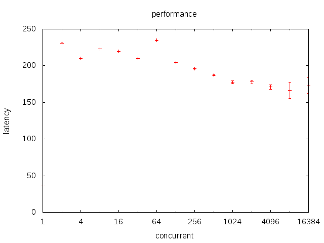

# 上下文切换技术简介

## logo

## 自我介绍

shell909090，七牛程序员，主要用python和golang。

## LICENSE

[cc-by-sa3.0](http://creativecommons.org/licenses/by-sa/3.0/deed.zh)

# 系统级上下文技术

## 术语

* 上下文
* 切换
* 调度
* 进程
* 线程

## 进程状态

* 就绪
* 运行
* 睡眠

## 性能

* fork的开销在40-50us不等
* pthread(nptl)的开销在9.5us左右

# 传统网络服务模型

## 如何工作

1. 父进程监听服务端口
2. 在有新连接建立的时候，父进程执行fork，产生一个子进程副本
3. 如果子进程需要的话，可以exec(例如CGI)
4. 父进程执行(理论上应当先执行子进程，因为exec执行的快可以避免COW)到accept后，发生阻塞
5. 上下文调度，内核调度器选择下一个上下文，如无意外，应当就是刚刚派生的子进程
6. 子进程进程进入读取处理状态，阻塞在read调用上，所有上下文均进入睡眠态
7. 随着SYN或者数据报文到来，CPU会唤醒对应fd上阻塞的上下文(wait_queue)，切换到就绪态，并加入调度队列
8. 上下文继续执行到下一个阻塞调用，或者因为时间片耗尽被挂起

## 评价

* 同步模型，编写自然，每个上下文可以当作其他上下文不存在一样的操作，每次读取数据可以当作必然能读取到。
* 进程模型自然的隔离了连接。即使程序复杂且易崩溃，也只影响一个连接而不是在整个系统。
* 生成和释放开销很大，需要考虑复用。
* 进程模式的多客户通讯比较麻烦，尤其在共享大量数据的时候。

# C10K问题

## 上下文重复建立开销

通过上下文池和复用上下文解决。

## 线程复用模式的问题

* 内存
* 内核陷入

## 内核调度器

1. linux2.4的调度器。
2. O(1)调度器。
3. CFS。

## 开销

yield每次耗费的时间随活跃线程数变化曲线

---

lock每次耗费的时间随活跃线程书变化曲线

# 多路复用

## 就绪通知 vs 异步IO

* 由用户读取 vs 由系统回调
* 在数据就绪时通知 vs 在数据IO完成后回调

## epoll

* ET
* LT

## 性能分析

* epoll_wait/ep\_poll\_callback
* epoll_ctl

## 固有缺陷

无法用于普通文件。

# 事件通知机制下的程序设计模型

## 用户态调度

如何在fd未就绪时接着服务其他连接？

将对应fd映射到处理这个fd的某组过程上的结构设计，被称为用户态调度。这样，当我们知道某个fd就绪时，可以激活对应的过程。

更广义的说，各种内核态带有wait\_queue的对象，都应当可以映射到某组过程上。例如时钟和锁。因此用户态调度可类比于内核态调度。

## coroutine

从图灵机的角度来说，整个机器的状态必然保存在有限个寄存器内。保存寄存器就是保存机器的执行状态。

程序执行两个栈——执行栈和环境栈。只要保存下执行栈就可以重启执行。

## 协程和线程的关系和区别

* 协程要获得CPU，必须在线程中执行
* 协程无法跨进程调度
* 同时执行的协程数不能大于容纳他的线程数
* 协程没有抢占
* 单线程中执行的协程，可以视为单线程应用

## golang协程性能

sched调用延迟随goroutine数变化

---

chan调用延迟随goroutine数变化

---

lock调用延迟随goroutine数变化

## python协程性能

* yield的开销大约是22ns
* greenlet的开销大约是500ns

---

yield from随层数变化

## 基于就绪通知的协程框架

1. 首先需要包装read/write，在发生read的时候检查返回。如果是EAGAIN，那么将当前协程标记为阻塞在对应fd上，然后执行调度函数。
2. 调度函数需要执行epoll(或者从上次的返回结果缓存中取数据，减少内核陷入次数)，从中读取一个就绪的fd。如果没有，上下文应当被阻塞到至少有一个fd就绪。
3. 查找这个fd对应的协程上下文对象，并调度过去。
4. 当某个协程被调度到时，他多半应当在调度器返回的路上——也就是read/write读不到数据的时候。因此应当再重试读取，失败的话返回1。
5. 如果读取到数据了，直接返回。

这样，异步的数据读写动作，在我们的想像中就可以变为同步的。而我们知道同步模型会极大降低我们的编程负担。

## CPS模型

所谓回调模型就是，在IO调用的时候，同时传入一个函数，作为返回函数。当IO结束时，调用传入的函数来处理下面的流程。

用一句话来描述CPS——他把一切操作都当作了IO，无论干什么，结果要通过回调函数来返回。从这个角度来说，IO回调模型只能被视作CPS的一个特例。

	add = lambda f, *nums: f(sum(nums))
	mul = lambda f, *nums: f(reduce(lambda x,y: x*y, nums))
	mul(lambda x: add(pprint.pprint, x, 1), 2, 3)

## 函数组件和返回值

函数为什么要用栈来描述层级调用关系？

## 回调函数的上下文环境

回调函数基本可以认同在一个独立的上下文中执行。

