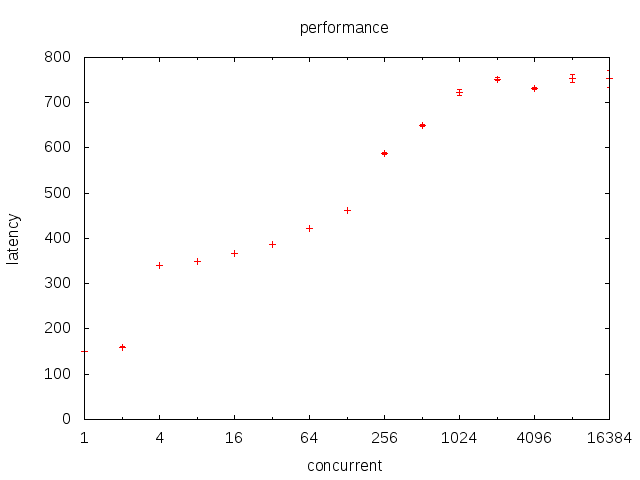

# 效率测试

## 测试环境

* Intel(R) Pentium(R) CPU G2030 @ 3.00GHz
* 8G内存
* debian jessie
* Linux 3.16-2-amd64
* 2014年10月27日

附注一下，该CPU有2核心，无HT，1ns3个时钟周期。

## 测试方法

测试代码如下：

	time -f "%e,%S,%c,%r,%s,%K,%P" ./perf_fork

数据的意义分别为: 总时间，内核CPU时间，context switch次数，读/写次数，内存耗用，CPU使用百分比。

数据处理方法如下：

    import numpy as np
	p = lambda s: [float(line.strip().split(',')[0]) for line in s.splitlines()]
	q = lambda s: [float(line.strip().split(',')[1]) for line in s.splitlines()]
	np.array(p(s)).mean()
	np.array(p(s)).var()
	np.array(q(s)).mean()
	np.array(q(s)).var()

# 基础开销测试

## 函数调用开销

使用[s_call](https://gitcafe.com/shell909090/context/blob/master/s_call.c)来测试性能，循环1G次。

	2.35,0.00,17,0,0,0,99%
	2.34,0.00,13,0,0,0,99%
	2.34,0.00,10,0,0,0,100%
	2.35,0.00,10,0,0,0,99%
	2.34,0.00,14,0,0,0,99%
	2.34,0.00,6,0,0,0,99%

统计结果如下：

* time mean = 2.34
* time var = 0.000022

每次call的开销为2.34ns，约7个指令周期。当然，这些并没有考虑调用压栈和数据返回。

## 内核调用开销

使用[s_syscall](https://gitcafe.com/shell909090/context/blob/master/s_syscall.c)来测试性能，循环1G次。这里特意选用了一个不可能失败的内核函数，getpid，来衡量每次进入getpid的开销。

	49.61,28.72,891,0,0,0,99%
	49.12,28.57,3582,0,0,0,99%
	49.21,29.66,5813,0,0,0,99%
	49.81,31.04,6076,0,0,0,99%
	49.48,28.59,749,0,0,0,99%
	49.63,29.76,6224,0,0,0,99%

统计结果如下：

* time mean = 49.47
* time var = 0.0585

这里可以看到，单次内核陷入的开销在50ns左右，约150个指令周期。内核进入开销比函数调用开销大了一个数量级不止，大约20倍左右。

# 系统上下文测试

## 进程fork开销

使用[s_fork](https://gitcafe.com/shell909090/context/blob/master/s_fork.c)程序(注释语句关闭模式)，循环1M次，重复6次，原始数据如下：

	49.04,26.83,29784,0,0,0,55%
	51.53,26.38,32057,0,0,0,52%
	49.88,26.02,30892,0,0,0,53%
	51.39,27.13,37573,0,0,0,54%
	52.89,28.12,37924,0,0,0,54%
	51.19,27.02,35880,0,0,0,54%

统计结果如下：

* time mean = 50.98
* time var = 1.52
* kernel mean = 26.92
* kernel var = 0.43

从数据上，我们可以简单得到结论。在测试设备上，每次fork的开销为51us，内核开销为27us，精确级别在1-2us左右。粗略换算一下，一次fork大约消耗了150k个时钟周期。

注意，这个数据并不代表fork本身的速度。因为除去fork之外，我们还有子进程退出的开销，父进程wait的开销。甚至严格来说，还包括了至少一次的context switch(有趣的是，这个取决于fork后是优先执行子进程还是父进程)。

但是作为进程模式的服务程序，这些开销都是预料中必须付出的。不过我们并没有模拟signal对性能的影响(简单测试表明，性能也会显著的变差)。

另外cs次数比产生的进程数远小，可能被第二颗核心执行掉了部分。看来要做精确的测试需要使用单核处理器。

## fork模式强制优先执行子进程

在[s_fork](https://gitcafe.com/shell909090/context/blob/master/s_fork.c)中，注意那句注释。当优先执行子进程时，会发生什么现象？

预期来说，应当不发生变化，或者轻微的变慢。因为我们预期系统优先执行子进程(以减少exec前的page cow)。如果发生变化，那么说明这个假定是不正确的。真实情况是优先执行父进程或者无保证。

如果发生变化，首先是一次context switch会变为两次。因为如果在产生了大量子进程后再依次cs，那么需要N+1次cs来结束所有子进程并返回父进程，平均每个子进程一次cs(N足够大的情况下基本近似，例如在标准配置下30000以上)。而如果每次产生子进程就切换，那么会变为每个子进程两次cs。

其次，先执行父进程导致在每次调度时的活跃进程数更高，因此调度器的每次执行开销更高。按照算法量级估计，大约是4倍以上。但是实际复杂度的估量比平均值更加麻烦——因为活跃数总是在不停的变化中。大约是Sum(logn)/n=log(n!)/n。因此，虽然在cs次数上减少，但是每次cs的开销会增加。

最后，先执行子进程会导致上下文描述符表项被频繁的重用，从而提高命中率。当然，在我们的测试程序中做不到这点，因为每次都是开满才开始回收的。因为直接回收会导致父进程等待子进程结束，从而导致缓慢。所以至少应当需要执行相当的数量才进行回收。

而我们摒弃了使用信号响应的方式进行回收，因为信号的速度比fork更慢，这会导致测试不准。

下面是实际原始数据：

	45.19,22.42,399890,0,0,0,51%
	47.66,22.46,414808,0,0,0,48%
	45.51,23.12,376053,0,0,0,52%
	46.35,22.10,401536,0,0,0,49%
	48.28,22.82,415162,0,0,0,48%
	47.44,22.34,413285,0,0,0,48%

统计结果如下：

* time mean = 46.73
* time var = 1.29
* kernel mean = 22.54
* kernel var = 0.11

解读上可以发现，每10次fork产生四次cs(这可能是因为第二颗核心执行了部分的子进程)，但是每次fork的开销降低为47us，内核CPU降为23us(用户态时间几乎不发生变化)，精确级别在1us左右。

这说明真实情况确实是先执行父进程或无保证。

## 线程建立销毁开销

使用[t_thread](https://gitcafe.com/shell909090/context/blob/master/t_thread.c)程序，循环1M次，重复6次，原始数据如下：

	9.57,8.22,21098,0,0,0,104%
	9.77,8.40,29704,0,0,0,104%
	9.36,8.17,10390,0,0,0,106%
	9.56,8.50,14514,0,0,0,107%
	9.35,8.34,7244,0,0,0,108%
	9.57,8.43,26351,0,0,0,106%

统计结果如下：

* time mean = 9.53
* time var = 0.02
* kernel mean = 8.34
* kernel var = 0.013

解读数据可以看到，thread模式的开销为9530ns(已经降到纳秒级了)，CPU将为8340ns，精确级别在20ns级别。粗略换算一下每次create的开销大约是30k个时钟周期。简单对比可以看出，thread模式比fork模式大约快了5倍。

## 纯线程切换开销

使用[t_yield.c](https://gitcafe.com/shell909090/context/blob/master/t_yield.c)程序研究线程切换开销。具体过程单独整理了一个文件，下面只贴出结论：

首先注意到一点，由于内核陷入开销的存在，因此这里所有数据都需要扣除50ns。因此图像需要向下移动50ns的距离。

基本可以看到，随着上下文数的增加，每次调度开销是随之增加的。而且两者近似的呈一条直线(虽然看起来比较扭曲)。这证明调度复杂度为O(logm)的推论基本是正确的。

另外，在1-2线程时性能特别优秀。这可能是线程数小于核数，导致大部分情况下根本未执行调度。对此作出的一点推论是。很多时候，我们为了充分利用CPU会作出worker = N+1的设定。如果IO并不是特别密集，可能性能反而比worker = N更差。

## sleep切换开销

使用[t_sleep.c](https://gitcafe.com/shell909090/context/blob/master/t_sleep.c)程序来测试usleep(0)的性能。100线程，1M次循环。下面是结论：

	66.55,90.62,4160,0,0,0,149%
	65.60,87.08,3238,0,0,0,145%
	65.28,83.95,2570,0,0,0,139%
	65.59,85.98,2366,0,0,0,143%
	65.67,86.79,1715,0,0,0,143%
	65.84,87.70,1896,0,0,0,145%

统计结果如下：

* time mean = 65.75
* time var = 0.1539

计算结果来说，1315ns。比同样的单纯调度，开销增加了916.8ns。但是在此期间请特别留意CPU利用率曲线。该曲线呈现出明显的先达峰后下降趋势。说明某些线程的sleep比另一些线程的优先得到调度，导致最后CPU利用率不足。从循环次数和下降趋势来说，很难说调度是“近似公平”的。

另外特别注意，我们针对1线程1M次循环得到的结论。

	53.81,2.52,20,0,0,0,4%
	53.88,2.47,22,0,0,0,4%
	53.79,2.48,16,0,0,0,4%
	55.09,2.35,49,0,0,0,4%
	56.19,2.27,50,0,0,0,4%
	55.71,2.43,62,0,0,0,4%

统计结果如下：

* time mean = 54.74
* time var = 0.945

这个结果表明，usleep后会导致很长(50us以上)的延迟，在这个时间段内不会有CPU消耗，哪怕usleep(0)。这是由于任务被标记为TASK_INTERRUPTIBLE，然后挂到timer队列上。timer队列调度是有频率限制的，低于这个时间片的sleep不会得到及时响应。这导致usleep测试CPU和调度性能实际上是个很没意义的行为。

## lock切换开销

使用[t_lock.c](https://gitcafe.com/shell909090/context/blob/master/t_lock.c)来研究pthread mutex的性能。

可以看到，mutex几乎不随着并发数的上升而上升。难道是我们的推论有误？

我详细的看了下源码。在glibc中，使用的是futex而非mutex实现的锁。前者会把系统置于TASK\_UNINTERRUPTIBLE而后者会置于TASK\_INTERRUPTIBLE。在ps中一望便知。而TASK\_INTERRUPTIBLE是未就绪状态，并不在调度范围内。因此，仅仅在某个上下文执行了unlock后，未进入lock时的短暂时间内，系统有两个可调度上下文。在进入lock后，系统又变为一个可调度上下文。因此，系统在大多数时候都在1-2个可调度上下文间浮动。

而且请注意，这里还是换出-换入两次(所有锁类代码都是这样)。

而read/write中，活跃上下文数是受客户影响的。当某个fd收到用户数据的时候，对应上下文就会从TASK\_INTERRUPTIBLE转变为就绪，而且在下一个阻塞(或处理完成)前始终占据调度队列。

# python性能测试

## yield模式性能测试

python下的测试就不用time了，我们改用python的timeit，循环100M次。具体可以看[py_yield.py](https://gitcafe.com/shell909090/context/blob/master/py_yield.py)。数据结果如下：

	7.64262938499 9.2919304393e-06
	5.41777145863 4.94284924931e-06

从结果来看，100M次循环的平均时间是5.4s，平均每次大约54ns。使用yield后变为76ns，增加了22ns。

## greenlet模式性能测试

这次代码在[py_greenlet.py](https://gitcafe.com/shell909090/context/blob/master/py_greenlet.py)，循环10M次。数据结果如下：

	5.35270996888 7.44085846125e-05
	5.31448976199 5.82336765673e-05

单次循环时间消耗为535ns。比最初的54ns，增加了481ns。基本来说，时间增长了10倍率。

这是预料中的，因为greenlet早就声明自己通过堆栈拷贝来实现上下文切换。这会消耗大量CPU时间。从原理上说，栈越深，消耗越大。但是测试结果表明两者几乎没有差异，栈深反而性能更加优异。

## yield from性能测试

这次代码在[py_yield_from.py](https://gitcafe.com/shell909090/context/blob/master/py_yield_from.py)，循环100M次。数据结果如下：

	11.3753386545 2.05564687993e-05
	8.83233247434 7.92599097725e-05
	6.31597025133 0.00346735863271

单次循环时间消耗为113.7ns。比最初的63.2ns，增加了50.5ns。单纯的yield为88.3ns，增加了25.1ns。

yield from需要在python3下执行，从数据上看，python3下执行循环加的过程比python2下更缓慢，而且yield也同样比python2下的缓慢(这也是python3经常被诟病的一个问题，经常比python2慢)。

但是针对2/3速度对比问题，我特别声明一下。这个测试没有针对2/3速度对比做定制，也没有经过精细分析。所以不能保证其他人在其他环境下执行出相反的结果。总之，目前我可以做出的简单结论是。python3和python2速度相仿，python2略快。

而yield from比yield更慢，这完全可以理解。在python2中，yield from需要用for来表达，这样的结果一个是难看，一个也未必快过yield from。

下面我们想要知道一下，随着yield的深度增加，速度是否减慢。用同一个程序里的test_all代码进行了简单的测试后，结果如下：

结论是，随着递归深度的增加，yield from的上下文切换速度是会减慢的。两者呈明显的线性关系。

# golang性能测试

## goroutine创建开销

下面是一组golang有关的测试，首先使用[g_goroutine.go](https://gitcafe.com/shell909090/context/blob/master/g_goroutine.go)来测试goroutine创建和销毁开销，执行10M次：

	5.70,0.11,598,0,0,0,99%
	5.70,0.12,77,0,0,0,99%
	5.66,0.14,334,0,0,0,99%
	5.66,0.10,271,0,0,0,99%
	5.57,0.16,47,0,0,0,99%
	5.77,0.10,521,0,0,0,99%

统计结果如下：

* time mean = 5.68
* time var = 0.0036

大致结果为创建开销568ns，大约是线程创建开销的1/20。注意代码没有保证goroutine执行完毕，所以可能会有一定误差。

## 调度开销

我们使用[g_sched.go](https://gitcafe.com/shell909090/context/blob/master/g_sched.go)来研究golang的调度。

可以看到，在很大范围内，延迟虽然随着并发升高而升高，但是升高的幅度并不大。即使是16K这个级别的并发，也只有250ns左右的延迟而已。

## chan开销

我们使用[g_chan.go](https://gitcafe.com/shell909090/context/blob/master/g_chan.go)来研究chan上的调度。

可以看到，chan的性能更加优秀，而且不随着并发的增长而增长，在所有的范围内基本都是60-70ns。这主要是因为chan并不需要“调度”，而只需要上下文切换。所以这个切换是非公平的。chan唤醒上下文的顺序并不一定按照在chan上阻塞的顺序。

## lock开销

我们使用[g_lock.go](https://gitcafe.com/shell909090/context/blob/master/g_lock.go)来研究chan上的调度。

让我颇为困惑的是，lock的性能居然比chan更优秀。在初始阶段都是30ns多点，在256并发上下遇到了剧烈的波动，以上就减少到了20ns。原理上说，lock同样也是不做出顺序假定，无调度的。但是这并不能说明为什么chan比lock性能更差。也许是chan内部做了一些额外工作。而且这些工作应当和并发无关，也就是局部(local)工作。

# C语言上下文调度

## setjmp/longjmp测试

使用[s_jmp](https://gitcafe.com/shell909090/context/blob/master/s_jmp.c)程序来测试setjmp的性能。1G次循环。下面是结论：

	5.77,0.00,29,0,0,0,99%
	5.70,0.00,30,0,0,0,99%
	5.71,0.00,22,0,0,0,99%
	5.71,0.00,23,0,0,0,99%
	5.70,0.00,30,0,0,0,100%
	5.70,0.00,23,0,0,0,99%

统计结果如下：

* time mean = 5.715
* time var = 0.000625

单次调度开销只有5.7ns，在所有测试中性能最优。(glibc-2.19/sysdeps/x86_64/setjmp.S)

## makecontext/swapcontext测试

使用[s_context](https://gitcafe.com/shell909090/context/blob/master/s_context.c)程序来测试ucontext的性能。100M次循环。下面是结论：

	33.42,13.08,163,0,0,0,99%
	33.43,13.40,147,0,0,0,99%
	33.39,13.24,143,0,0,0,99%
	33.41,13.25,156,0,0,0,99%
	33.70,13.41,328,0,0,0,99%
	33.42,13.18,290,0,0,0,99%

统计结果如下：

* time mean = 33.46
* time var = 0.0115

单次调度开销高达167.3ns，仅比系统的sched在高线程下略快。这事很奇怪，因为根据我看到的源码(glibc-2.19/sysdeps/unix/sysv/linux/x86_64/setcontext.S)，getcontext/setcontext在glibc中是用汇编实现的。其中陷入内核只是为了设定signal mask。
